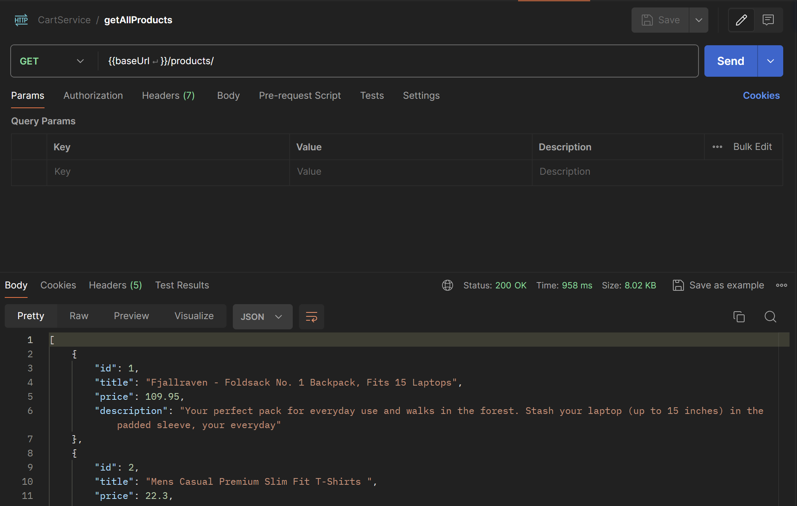
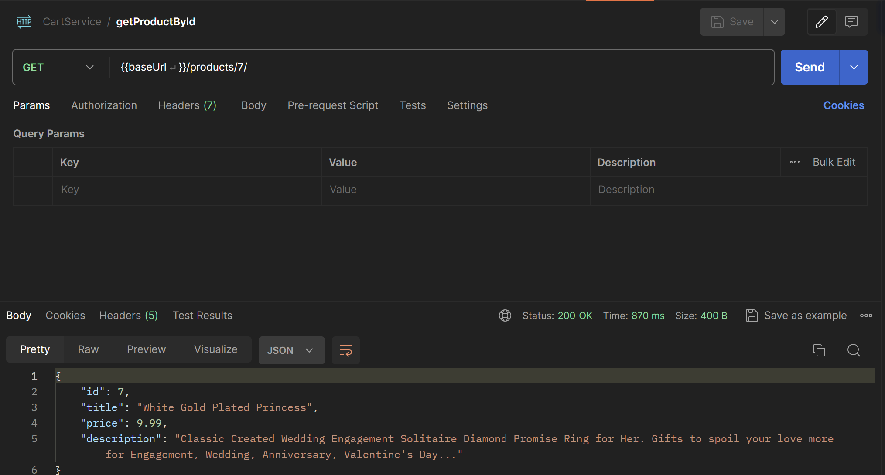
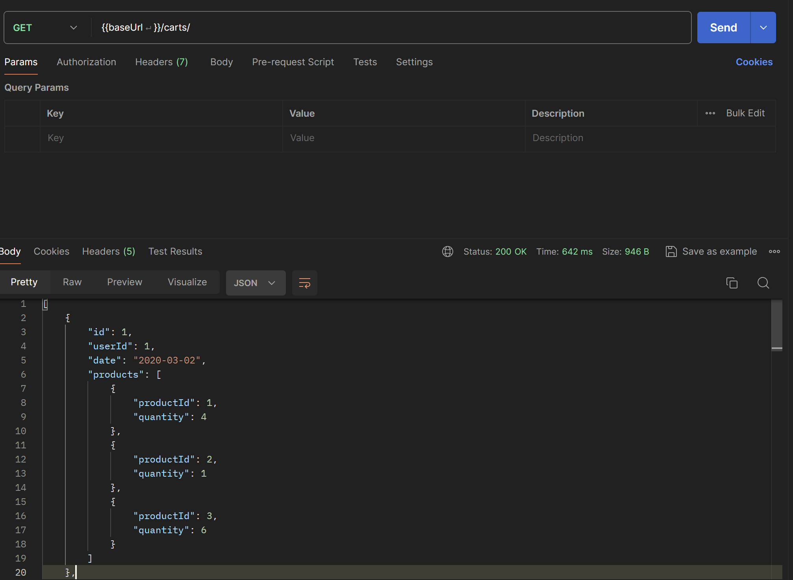
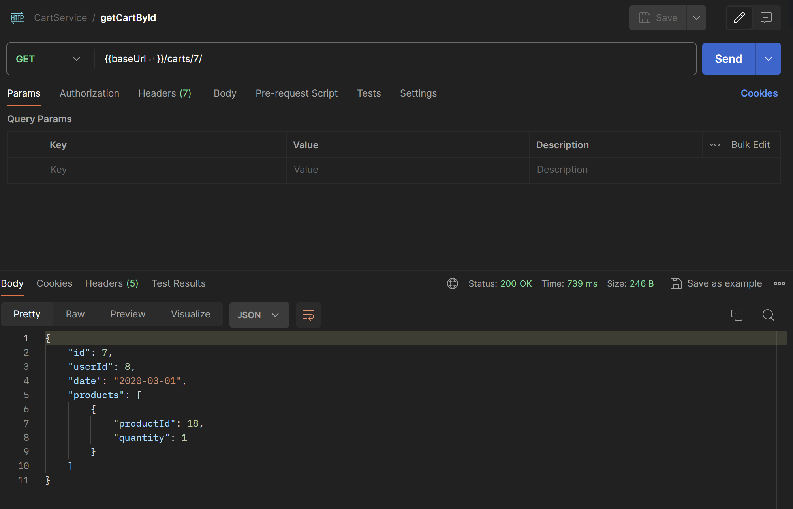
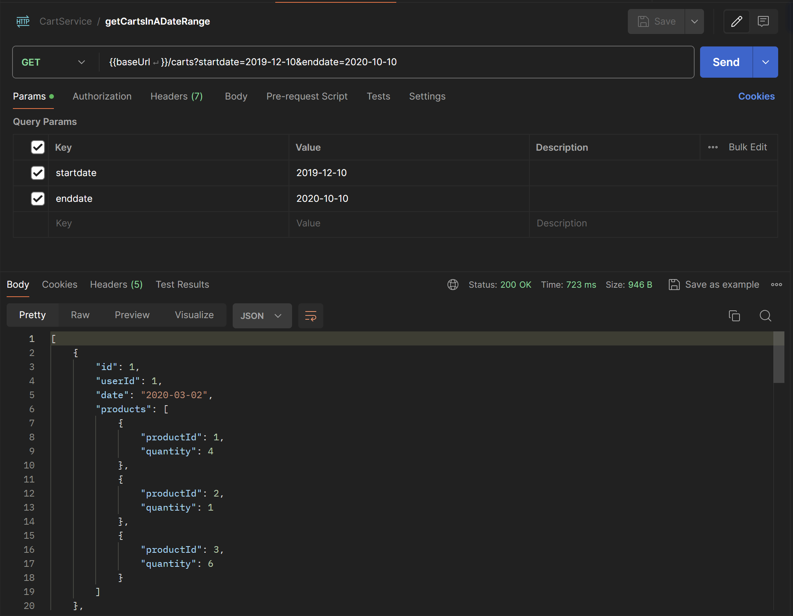
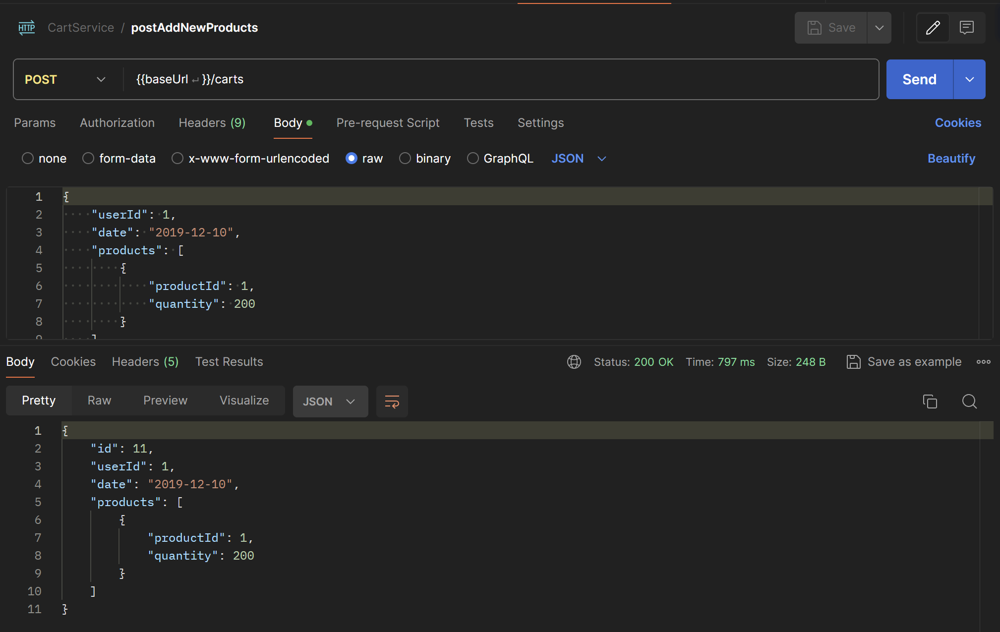

# Cart Service

## API Endpoints

### `products`
- Get all products
    ```http
    GET /products/
    ```
    

- Get Product by ID
    ```http
    GET /products/{id}/
    ```
    

### `carts`
- Get all carts
    ```http
    GET /carts/
    ```
    

- Get Cart by ID
    ```http
    GET /carts/{id}/
    ```
    
- Get Carts in a Date Range
    ```http
    GET /carts?startdate={startdate}&enddate={enddate}
    ```
    
- Add products to cart
    ```http
    POST /carts

    {
        "userId": 1,
        "date": "2019-12-10",
        "products": [
            {
                "productId": 1,
                "quantity": 200
            }
        ]
    }
    ```
    
- Update products in a cart
    ```http
    PUT /carts/{id}

    {
        "userId": 1,
        "date": "2019-12-10",
        "products": [
            {
                "productId": 1,
                "quantity": 200
            }
        ]
    }
    ```
